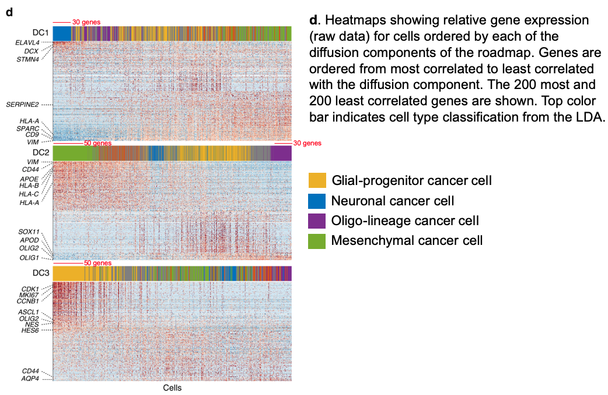

The document will be split into the following sections:

  1. [Verhaak/TCGA subtypes](#anchor_1) - We get the genesets that define the four Verhaak/TCGA subtypes
  2. [Wang et al 2017](#anchor_2) - We get the three gene sets defined in Wang et al 2017 
  3. [Neftel et al 2019](#anchor_3) - We get all of the gene sets defined in Neftel et al 2019 (defined using scRNA-seq data)
  4. [Wang et al 2019](#anchor_4) - We get the list of differentially expressed genes between mesenchymal and proneural cells defined in Wang et al 2019 (defined using scRNA-seq data) 
  5. [Couturier et al 2020](#anchor_5) - We get lists of genes in order of their correlation with the diffusion components used to classify cells in Couturier et al 2020.
  6. [MSigDB](#anchor_6) - We combine all MSigDB Version 7.0 gene sets with our GBM gene lists


# Verhaak/TCGA subtypes {#anchor_1}

In [Verhaak et al, Cancer Cell, 2010](https://doi.org/10.1016/j.ccr.2009.12.020) four glioblastoma subtypes are defined using gene expression data generated by The Cancer Genome Atlas; proneural, neural, classical and mesenchymal subtypes. Gene sets defining these subtypes will be downloaded from the Molecular Signatures Database (MSigDB).

```{r Verhaak, cache=TRUE}
suppressPackageStartupMessages({
  library(glue)
  library(tidyverse)
  library(readxl)
  library(fgsea)
})
 
# Download files
base_url <- "http://software.broadinstitute.org/gsea/msigdb/download_geneset.jsp?geneSetName=VERHAAK_GLIOBLASTOMA_"
if(!file.exists("data/VERHAAK_GLIOBLASTOMA_MESENCHYMAL.txt")){
  download.file(url = glue("{base_url}MESENCHYMAL&fileType=txt"), destfile = "data/VERHAAK_GLIOBLASTOMA_MESENCHYMAL.txt")
  download.file(url = glue("{base_url}CLASSICAL&fileType=txt"), destfile = "data/VERHAAK_GLIOBLASTOMA_CLASSICAL.txt")
  download.file(url = glue("{base_url}NEURAL&fileType=txt"), destfile = "data/VERHAAK_GLIOBLASTOMA_NEURAL.txt")
  download.file(url = glue("{base_url}PRONEURAL&fileType=txt"), destfile = "data/VERHAAK_GLIOBLASTOMA_PRONEURAL.txt")
}

# Check the files are there
str_subset(list.files("data"), "VERHAAK")

# Have a look at the first one
read.delim("data/VERHAAK_GLIOBLASTOMA_CLASSICAL.txt") 
```


# Wang et al 2017 - three subtypes {#anchor_2}

In [Wang et al, Cancer Cell, 2017](https://doi.org/10.1016/j.ccell.2017.06.003) three glioblastoma subtypes are defined using gene expression data from 369 IDH-WT GBMs; proneural, classical and mesenchymal subtypes. Gene sets defining these subtypes were provided in Supplmentary table 1 of the paper.
```{r Wang_et_al, cache=TRUE}
# Download Supplmentary table 1 from Wang et al, Cancer Cell, 2017
if(!file.exists("data/1-s2.0-S1535610817302532-mmc2.xlsx")){
  download.file(url = "https://ars.els-cdn.com/content/image/1-s2.0-S1535610817302532-mmc2.xlsx", destfile = "data/1-s2.0-S1535610817302532-mmc2.xlsx")
}
# Import data
S1 <- read_excel("data/1-s2.0-S1535610817302532-mmc2.xlsx", sheet = 3)
head(S1)

# Get gene sets
mesenchymal <- S1[4:53, c(1,2,5)]
colnames(mesenchymal) <- c("GeneSymbol", "avg_expr", "ttest_p-val")
proneural <- S1[4:53, c(9,11,13)]
colnames(proneural) <- c("GeneSymbol", "avg_expr", "ttest_p-val")
classical <- S1[4:53, c(17,20,21)]
colnames(classical) <- c("GeneSymbol", "avg_expr", "ttest_p-val")

# Write out
write_tsv(mesenchymal, path = "data/Wang_2017_mesenchymal.tsv")
write_tsv(proneural, path = "data/Wang_2017_proneural.tsv")
write_tsv(classical, path = "data/Wang_2017_classical.tsv")
```


# Neftel et al 2019 - four expression states {#anchor_3}

In [Neftel et al, Cell, 2019](https://doi.org/10.1016/j.cell.2019.06.024), using scRNA-seq the authors define four expression states;

 1. neural-progenitor-like (NPC-like)
 2. oligodendrocyte-progenitor-like (OPC-like)
 3. astrocyte-like (AC-like)
 4. mesenchymal-like (MES-like)

The MES-like and NPC-like were further subdivided into two subprograms. Although each glioblastoma sample contained cells in multiple states, the relative frequency of each state varied between tumors. We will download the gene sets associated with each of the states, presented in supplementary table 2 from the paper.

From the information in at the top of the excel file:

 - Each meta-module was defined as all genes whose average log-ratios were above 2 and was restricted to the top 50 genes with highest log-ratios for that group of signatures.
 - Genes are listed in descending order according to these average log-ratios.

```{r Neftel_et_al, cache=TRUE}
# Download Supplmentary table 2 from Neftel et al, Cell, 2019
if(!file.exists("data/1-s2.0-S0092867419306877-mmc2.xlsx")){
  download.file(url = "https://ars.els-cdn.com/content/image/1-s2.0-S0092867419306877-mmc2.xlsx", destfile = "data/1-s2.0-S0092867419306877-mmc2.xlsx")
}
# Import data
S2 <- read_excel("data/1-s2.0-S0092867419306877-mmc2.xlsx", sheet = 1, skip = 4)
head(S2)

# Write out as tsv
write_tsv(S2, path = "data/Nefel_2019_states.tsv")
```


# Wang et al 2019, Proneural/Mesenchymal subtypes {#anchor_4}

In [Wang et al, Cancer Discovery, 2019](https://doi.org/10.1158/2159-8290.cd-19-0329) the authors found two patient-independent clusters of neoplastic cells consistent across three different sequencing platforms. A differential expression test between clusters identified markers of the proneural (e.g., ASCL1, OLIG2) and mesenchymal (e.g., CD44, CHI3L1) subtypes as significant. These results are available in Supplementary Table S3.

```{r Wang_et_al_2019, cache=TRUE}
# Download Supplmentary table 3 from Wang et al, Cancer Discovery, 2019
if(!file.exists("data/219026_2_supp_5782670_py1999.xlsx")){
  download.file(url = "https://cancerdiscovery.aacrjournals.org/highwire/filestream/46371/field_highwire_adjunct_files/3/219026_2_supp_5782670_py1999.xlsx", destfile = "data/219026_2_supp_5782670_py1999.xlsx")
}

# Import data
S2 <- read_excel("data/219026_2_supp_5782670_py1999.xlsx", sheet = 1)
head(S2)

# Get the top 50 genes associated with the proneural subtype
proneural <- arrange(S2, `avg_logFC (MES/PN)`) %>% select(Gene) %>% unlist() %>% .[1:50]

# Get the top 50 genes associated with the proneural subtype
mesenchymal <- arrange(S2, -`avg_logFC (MES/PN)`) %>% select(Gene) %>% unlist() %>% .[1:50]

cbind(proneural, mesenchymal)

# Write out as tsv
write_tsv(as_tibble(cbind(proneural, mesenchymal)), path = "data/Wang_2019.tsv")
```


# Couturier et al 2020, trilineage heirarchy {#anchor_5}

In [Couturier et al, Nature Communications, 2020](https://doi.org/10.1038/s41467-020-17186-5) the authors created a human fetal brain cell roadmap and projected cancer cells into this dataset using diffusion embedding. Unfortunately they didn't make available gene sets to classify each GBM cell state, such as the top 40 gene signatures used in the heatmap in Fig. 1e, but they did make available lists of cancer genes in descending order of correlation with each diffusion component of the roadmap (Supplementary Data 2).

Based on the way the diffusion components were presented in the paper in Fig. 3d I'm going to take;

 - 30 genes from the bottom of DC1 as neuronal cancer cell markers
 - 50 genes from the bottom of DC2 as mesenchymal cancer cell markers
 - 30 genes from the top of DC2 as oligo-lineage cancer cell markers
 - 50 genes from the top of DC3 as glial-progenitor cancer cell markers

To make things clearer I've copied Fig. 3d from the paper and annotated in red the genes I'm taking. The red lines are estimates based on a heatmap width of 400 genes. I also copied the relevant text from the figure legend.



```{r Couturier_et_al_2020, cache=TRUE}
# Download Supplmentary Data 2 from Couturier et al, Nature Communications, 2020
if(!file.exists("data/1467_2020_17186_MOESM5_ESM.csv")){
  download.file(url = "https://static-content.springer.com/esm/art%3A10.1038%2Fs41467-020-17186-5/MediaObjects/41467_2020_17186_MOESM5_ESM.csv", destfile = "data/1467_2020_17186_MOESM5_ESM.csv")
}

S2 <- read_csv("data/1467_2020_17186_MOESM5_ESM.csv", skip = 3, col_names = c("DC1", "DC2", "DC3"))
head(S2)
# The dimensions of the data frame are not what I expected. From the description in the paper I thought it would be 400 rows and 3 columns but it's:
dim(S2)
#[1] 551   3

couturier_neuronal <- c(S2$DC1[c(nrow(S2)-29):nrow(S2)], rep(NA,20))
couturier_mesenchymal <- S2$DC2[c(nrow(S2)-49):nrow(S2)]
couturier_oligo_lineage  <- c(S2$DC2[1:30], rep(NA,20))
couturier_glial_progenitor <- S2$DC3[1:50]

# Write out as tsv
write_tsv(data.frame(couturier_neuronal, couturier_mesenchymal, couturier_oligo_lineage, couturier_glial_progenitor)
, path = "data/Couturier_2020.tsv")
```

# MSigDB {#anchor_6}

MSigDB Version 7.0 gene sets from www.gsea-msigdb.org/gsea/downloads.jsp on 27/08/2020. We import these .gmt files and save them out as a list. We will also add some GBM subtype/cell state gene sets. Once save out in this 'list of lists' format we can use it for GSEA with the `fgsea` R package.

```{r MSigDB, cache=TRUE}
if(!file.exists("data/MSigDB_and_gbm_gene_lists.rds")){
  
  #Import .gmt files downloaded from MSigDB:
  
  # All current MSigDB gene sets
  all_gene_sets <- gmtPathways("data/msigdb.v7.1.symbols.gmt")
  # Have a quick look at the data format
  str(head(all_gene_sets))
  
  # Hallmark gene sets - Coherently expressed signatures derived by aggregating
  # many MSigDB gene sets to represent well-defined biological states or processes.
  hallmark_gene_sets <- gmtPathways("data/h.all.v7.1.symbols.gmt")
  
  # c1: positional gene sets - for each human chromosome and cytogenetic band.
  positional_gene_sets <- gmtPathways("data/c1.all.v7.1.symbols.gmt")
  
  # c2: curated gene sets - from online pathway databases, publications in
  # PubMed, and knowledge of domain experts;
  # chemical and genetic perturbations
  perturbations_gene_sets <- gmtPathways("data/c2.cgp.v7.1.symbols.gmt")
  # all canonical pathways
  canonical_pathways_gene_sets <- gmtPathways("data/c2.cp.v7.1.symbols.gmt")
  # bioCarta
  biocarta_gene_sets <- gmtPathways("data/c2.cp.biocarta.v7.1.symbols.gmt")
  # KEGG
  kegg_gene_sets <- gmtPathways("data/c2.cp.kegg.v7.1.symbols.gmt")
  # PID
  pid_gene_sets <- gmtPathways("data/c2.cp.pid.v7.1.symbols.gmt")
  # reactome
  reactome_gene_sets <- gmtPathways("data/c2.cp.reactome.v7.1.symbols.gmt")
  
  # c3: regulatory target gene sets - based on predicted transcription factor binding sites.
  # All transcription factor targets, gene symbols
  tf_gene_sets <- gmtPathways("data/c3.tft.v7.1.symbols.gmt")
  
  # c4: computational gene sets - defined by mining large collections of
  # cancer-oriented microarray data.
  # cancer gene neighborhoods
  cancer_gene_gene_sets <- gmtPathways("data/c4.cgn.v7.1.symbols.gmt")
  # cancer modules
  cancer_module_gene_sets <- gmtPathways("data/c4.cm.v7.1.symbols.gmt")
  
  # c5: GO gene sets -  genes annotated by the same GO terms.
  # biological processes
  go_bp_gene_sets <- gmtPathways("data/c5.bp.v7.1.symbols.gmt")
  
  # c6: oncogenic gene sets - defined directly from microarray gene
  # expression data from cancer gene perturbations.
  oncogenic_gene_sets <- gmtPathways("data/c6.all.v7.1.symbols.gmt")
  
  # c7:	immunologic gene sets  defined directly from microarray gene
  # expression data from immunologic studies.
  immunologic_gene_sets <- gmtPathways("data/c7.all.v7.1.symbols.gmt")
  
  # Gene sets from Neftel et al 2019, Wang et al 2017, Wang et al 2019, Courturier 2020 & Verhaak
  neftel <- read_tsv("data/Neftel_2019_states.tsv")
  wang2017_proneural <- read_tsv("data/Wang_2017_proneural.tsv")
  wang2017_mesenchymal <- read_tsv("data/Wang_2017_mesenchymal.tsv")
  wang2017_classical <- read_tsv("data/Wang_2017_classical.tsv")
  wang2019 <- read_tsv("data/Wang_2019.tsv")
  couturier2020 <- read_tsv("data/Couturier_2020.tsv")
  verhaak_proneural <- read_tsv("data/VERHAAK_GLIOBLASTOMA_PRONEURAL.txt", skip = 2, col_names = FALSE)
  verhaak_neural <- read_tsv("data/VERHAAK_GLIOBLASTOMA_NEURAL.txt", skip = 2, col_names = FALSE)
  verhaak_mesenchymal <- read_tsv("data/VERHAAK_GLIOBLASTOMA_MESENCHYMAL.txt", skip = 2, col_names = FALSE)
  verhaak_classical <- read_tsv("data/VERHAAK_GLIOBLASTOMA_CLASSICAL.txt", skip = 2, col_names = FALSE)

  gbm_lists <- list(neftel_MES1 = neftel$MES1[complete.cases(neftel$MES1)],
                 neftel_MES2 = neftel$MES2[complete.cases(neftel$MES2)],
                 neftel_AC = neftel$AC[complete.cases(neftel$AC)],
                 neftel_OPC = neftel$OPC[complete.cases(neftel$OPC)],
                 neftel_NPC1 = neftel$NPC1[complete.cases(neftel$NPC1)],
                 neftel_NPC2 = neftel$NPC2[complete.cases(neftel$NPC2)],
                 neftel_G1S = neftel$`G1/S`[complete.cases(neftel$`G1/S`)],
                 neftel_G2M = neftel$`G2/M`[complete.cases(neftel$`G2/M`)],
                 wang2017_proneural = wang2017_proneural$GeneSymbol,
                 wang2017_mesenchymal = wang2017_mesenchymal$GeneSymbol,
                 wang2017_classical = wang2017_classical$GeneSymbol,
                 couturier_neuronal = couturier2020$couturier_neuronal[complete.cases(couturier2020$couturier_neuronal)],
                 couturier_mesenchymal = couturier2020$couturier_mesenchymal,
                 couturier_oligo_lineage = couturier2020$couturier_oligo_lineage[complete.cases(couturier2020$couturier_oligo_lineage)],
                 couturier_glial_progenitor = couturier2020$couturier_glial_progenitor,
                 wang2019_proneural = wang2019$proneural,
                 wang2019_mesenchymal = wang2019$mesenchymal,
                 verhaak_proneural = verhaak_proneural$X1,
                 verhaak_neural = verhaak_neural$X1,
                 verhaak_mesenchymal = verhaak_mesenchymal$X1,
                 verhaak_classical = verhaak_classical$X1)
  
  # Combine as a list of lists
  pathways <- list(all_gene_sets, hallmark_gene_sets, positional_gene_sets,
                   perturbations_gene_sets, canonical_pathways_gene_sets, 
                   biocarta_gene_sets, kegg_gene_sets, pid_gene_sets, reactome_gene_sets,
                   tf_gene_sets, cancer_gene_gene_sets, cancer_module_gene_sets,
                   go_bp_gene_sets, oncogenic_gene_sets, immunologic_gene_sets,
                   gbm_lists)
  # How many gene sets in each category?
  sapply(pathways, length)
  # Save out for faster loading next time
  saveRDS(pathways, "data/MSigDB_and_gbm_gene_lists.rds")
} else {
  pathways <- readRDS("data/MSigDB_and_gbm_gene_lists.rds")
}
```
